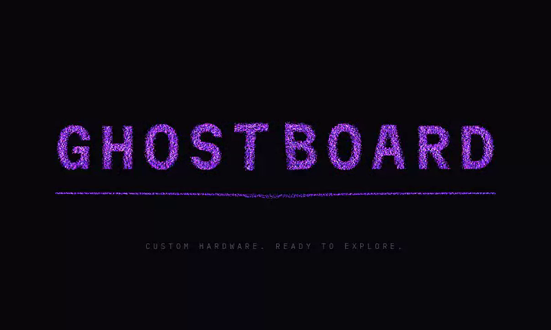

# GHOSTBOARD OS

**CUSTOM HARDWARE. READY TO EXPLORE.**

A lightweight, instant desktop for the GHOSTBOARD cyberdeck: Debian 13 + XFCE,
themed from a single palette file, with Claude Code at the centre and on-device
computer use exposed to it over MCP.

Windows 11 in structure — floating centred taskbar, rounded corners, mica
translucency, a floating start menu with search on top. GHOSTBOARD in skin —
near-black ground, one spectral violet accent, monospace only where there is
terminal or data.



---

## Target hardware

| Part | Spec |
| --- | --- |
| Board | Radxa X4 — Intel N100, **16 GB RAM** |
| Storage | M.2 2230 NVMe, **512 GB**, OS boots from it |
| Display | 4-inch HDMI panel, **800 × 480** — constraint #1 |
| Keyboard | BlackBerry Q20 (BB Q20 PMOD) over USB HID |
| Power | USB-C PD power bank — every watt counts |
| Companion | ESP32 boards running **Bruce** (M5Stick, T-Embed, CYD), plugged in over USB |

800 × 480 is the constraint that decides everything else: 15 px font floor,
34 px taskbar, thin scrollbars, no desktop icons, full-screen by default.

## Keyboard and window management

The deck has a thumb keyboard and no mouse, so the keyboard is the primary path
and the mouse is the exception.

### Command palette — `Super + Space`

`ghost-run` is one fuzzy search over everything reachable at once:

| Section | What it offers |
| --- | --- |
| `APP` | Every installed `.desktop` launcher |
| `CMD` | The `ghost-*` tools, each with what it does |
| `CARTE` | Connected ESP32 boards — opens their serial console directly |
| `FEN` | Open windows — switches to them |
| `BUREAU` | Virtual desktops |

The engine is **rofi** — not a daemon: it starts, you choose, it exits. It is
themed from `brand/palette.toml` like everything else, and its geometry is
**computed** from the panel size so the list can never overflow 480 px of
height. Boards come from `ghost-bruce list --json`, so detection has one
implementation, not two.

The Q20 has no Super key: `30-keyboard-bbq20` maps **Right Alt → Super**, and
`Ctrl+Alt+Space` is bound to the same action so you are never dependent on a
single remap. `ghost-run --list` prints what the palette would offer, without
opening anything.

### Desktops and tiling

Four named desktops — **SHELL · AGENT · BOARDS · WEB** — with a compact pager in
the taskbar. On a 480 px-tall panel, switching desktop replaces resizing windows.

| Keys | Action |
| --- | --- |
| `Super` + `1`–`4` | Go to desktop |
| `Super+Shift` + `←/→` | Move the active window to the next desktop |
| `Super` + `←/→` | Tile left / right half |
| `Super+Ctrl` + `←/→` | Tile to a top corner |
| `Super+Ctrl+Shift` + `←/→` | Tile to a bottom corner |
| `F11` | Full screen |
| `Super+Space` | Command palette |
| `Ctrl+Alt+T` | Terminal |

Two 40-column terminals fit side by side on 800 px. The pager costs a panel
plugin, not a process.

### Serial console

`ghost-bruce console` is raw by default — correct for a serial terminal, where
the board owns echo and editing. Beyond that:

```bash
ghost-bruce console --line        # local editing, persistent history, Tab recall
ghost-bruce console --timestamp   # relative timestamp on every received line
ghost-bruce watch                 # follow plug/unplug live
ghost-bruce list --json           # machine-readable, consumed by ghost-run
```

Tab completion draws on **your history**, not on a list of firmware commands:
Bruce's command set depends on its version, and offering invented ones would be
worse than offering none. `--timestamp` matters when a board is boot-looping —
*when* a line arrived is often worth more than what it said.

## Performance targets

| Target | Value |
| --- | --- |
| Boot to usable desktop | **< 20 s** |
| RAM at rest, desktop loaded | **< 900 MB** |
| GPU loop after boot | **none** — the WebGL context is destroyed |
| App launch | immediate — NVMe is there to be used |

Measured with `ghost-bench`, recorded in [BENCHMARKS.md](BENCHMARKS.md).
Numbers in that file come from the deck itself, never from an estimate.

---

## Install order

Run the steps in order. Each one is idempotent — re-running it fixes only what
is missing. Steps that touch the display, bootloader or session manager ask for
confirmation first.

```bash
git clone <this-repo> /opt/ghostboard-os
cd /opt/ghostboard-os

sudo ./install/ghostboard-install.sh --list        # what will run
sudo ./install/ghostboard-install.sh --dry-run     # writes nothing, shows everything
sudo ./install/ghostboard-install.sh               # the real thing
```

### Before you start — read this

1. **Get SSH working first.** `00-preflight` refuses to let the display step run
   without it. If the panel goes dark, SSH is the only way back in.
   Tailscale is strongly recommended: a LAN-only SSH is useless once the deck
   leaves the house.
   ```bash
   sudo apt install openssh-server && sudo systemctl enable --now ssh
   curl -fsSL https://tailscale.com/install.sh | sh && sudo tailscale up
   ```
2. **Image the SSD.** From another machine, drive in a USB enclosure:
   ```bash
   sudo dd if=/dev/nvme0n1 bs=64M status=progress | zstd -T0 > ghostboard-base.img.zst
   ```
   This is the only guaranteed way back if the bootloader or the panel breaks.

### The steps

| Step | What it does |
| --- | --- |
| `00-preflight` | Surveys the real hardware, compares it to target, checks the SSH rescue path. **Gate for the risky steps.** |
| `10-base-system` | Base packages, `en_US.UTF-8`, `noatime` on root, weekly TRIM, swappiness, power profile |
| `20-display-800x480` | Forces the 800 × 480 mode in Xorg and the kernel. **Arms a 3-minute auto-revert.** |
| `30-keyboard-bbq20` | Repeat rate for a thumb keyboard, XKB overlay mapping Right Alt → Super |
| `40-xfce-desktop` | XFCE component by component (never the `xfce4` metapackage), LightDM, default config |
| `50-theme` | IBM Plex Mono + Martian Mono, renders the whole theme from the palette, installs the tools |
| `60-nodejs-claude-code` | Node 22 LTS from NodeSource, Claude Code under a user-owned npm prefix |
| `70-mcp-computer-use` | The computer-use MCP server, registered with Claude Code; dedicated agent display installed but off |
| `80-boot-animation` | Chromium, three.js, the WebGL splash, and the `GHOSTBOARD` session entry |
| `90-ghost-bruce` | pyserial, `dialout` membership, udev rules for ESP32 USB bridges |
| `93-session-slimming` | **Main RAM lever.** Drops the accessibility bridge, thumbnailer, Thunar daemon, irrelevant gvfs monitors, UPower — ~130 MB of services nobody asked for |
| `95-perf-tuning` | Disables systemd services that earn nothing on a deck, bounds the journal, caps unit timeouts |
| `96-boot-chain` | **Main boot lever.** GRUB timeout → 0, trimmed initramfs, `/tmp` in RAM, NVMe scheduler, and the option to drop the display manager entirely |
| `99-measure` | Audits and measures. Changes nothing. |

Then **reboot**, pick the **GHOSTBOARD** session at the login screen, and:

```bash
sudo ghost-display-guard keep    # only if the panel actually works
ghost-perf                       # every optimisation, verified on the live system
ghost-bench --markdown /opt/ghostboard-os/BENCHMARKS.md
```

Resume a failed run with `--from <step>`; force a completed one with `--force`.

---

## Re-theming: one file

`brand/palette.toml` is the **only** place a colour, font or interface metric is
written by hand. Everything else is generated from it — GTK 2/3/4, window
decorations, the terminal, the wallpaper, the taskbar, the start button icon,
and the boot animation.

```bash
$EDITOR brand/palette.toml     # change one hex
sudo ghost-theme apply         # regenerates everything
ghost-theme reload             # or log out and back in
```

`ghost-theme apply` refuses to install a palette that fails its own legibility
check — contrast ratios and the 15 px font floor are verified before anything is
written. Run `ghost-theme check` on its own to see the numbers.

| Role | Hex | Meaning |
| --- | --- | --- |
| Background | `#08070C` | Desktop, window bodies |
| Panel | `#14111C` | Taskbar, start menu, raised surfaces |
| Separator | `#251F35` | Borders, rules, field outlines |
| Accent | `#A855F7` | Active state — **what the machine is doing** |
| Input | `#FF4D8D` | **What you type**, and errors |
| Text | `#D6D2E0` | Primary text |
| Text dim | `#6E6880` | Labels, placeholders |

One accent colour. `input` is not a second accent: it is a semantic marker for
your keystrokes and for failure, and it is used for nothing else.

Fonts: **Martian Mono** for the logotype and window titles only, **IBM Plex
Mono** everywhere else, 15 px floor.

---

## Architecture

Reasoning runs **on the deck** — an on-device LLM (LM Studio serving Dolphin)
is the default and works offline. Claude Code stays available for heavier,
tool-using work when there's a network. Two brains, local first.

```
  On the deck (Radxa X4, N100)                 Cloud (optional, online)
  ────────────────────────────                 ────────────────────────
  LM Studio · Dolphin   ◄── ghost-llm          Anthropic API
   OpenAI API :1234/v1      (local reasoning)    ▲
                                                 │ ghost-claude
  Claude Code  ──────────────────────────────────┘  (agentic, when online)
   │  terminal + files
   ▼  MCP, stdio
  ghostboard-computer-use
   │  screenshot · click · type · key
   ▼
  X display (:0, or :1 for a dedicated agent screen)
```

**On-device reasoning** is `ghost-llm` → LM Studio → Dolphin, over an
OpenAI-compatible API on `127.0.0.1:1234`. It is CPU inference on the N100 —
a few tokens per second, not cloud speed — but it needs no network and leaks
nothing. See [docs/LOCAL-LLM.md](docs/LOCAL-LLM.md).

**Control of the screen** is on-device too: the computer-use MCP server drives
the X display for whichever brain is asking.

Claude Code can also be pointed **at the local model** — `ghost-claude --local`
runs it through `ghost-llm-proxy`, which translates the Anthropic Messages API
to LM Studio's OpenAI API. It works, but a small local model is weak at the
agentic loop; it's for offline chat/simple edits, not heavy agent work. See
[docs/CLAUDE-CODE-LOCAL.md](docs/CLAUDE-CODE-LOCAL.md).

### Computer use over MCP

`mcp-computer-use/server.js` — **zero npm dependencies**, on purpose. It starts
in ~25 ms, there is nothing to update on the deck, and the MCP JSON-RPC handling
is 80 lines. Capture uses `scrot`, input uses `xdotool`; both are invoked on
demand and nothing runs in the background.

| Tool | Purpose |
| --- | --- |
| `screenshot` | PNG of the screen, **native 800 × 480, never rescaled** (~512 image tokens) |
| `click` | Absolute click; off-screen coordinates are rejected with an explicit error |
| `type` | Literal text, per-character |
| `key` | X11 combinations — `Return`, `ctrl+c`, `super` |
| `scroll` | Needed: 480 px of height, most lists overflow |
| `screen_info` | Geometry and pointer without paying for an image |

```bash
node tests/test-mcp.js       # 22 checks against a live X server
```

### Dedicated agent session (installed, off by default)

By default the agent sees your desktop. To give it a screen of its own:

```bash
ghost-agent-session on       # Xvfb :1 at 800 × 480, MCP switched to it
ghost-agent-session status
ghost-agent-session off
```

Costs nothing while off. The virtual screen is exactly 800 × 480, so click
coordinates stay valid whichever mode you use. See
[docs/agent-session.md](docs/agent-session.md).

---

## Boot animation

The GHOSTBOARD logotype does not appear — it **assembles**, in five acts, from
particles sampled off the rasterised wordmark at runtime. Then **the GL context
is explicitly destroyed** (`WEBGL_lose_context`, all buffers disposed, render
loop stopped). This is the only animation in the OS.


| # | Act | Duration | What happens |
| --- | --- | ---: | --- |
| 01 | **Ignite** | 220 ms | A scanline sweeps down the panel. Particles do not exist before it passes — they are born on the line and peel off it. |
| 02 | **Seek** | 380 ms | Turbulent drift through a procedural flow field. The cloud is searching, not converging. |
| 03 | **Lock** | 620 ms | Letters land **one at a time**, left to right, each with a brief flash and a horizontal band tear. |
| 04 | **Settle** | 380 ms | The accent rule draws itself left to right; the slogan types in, block cursor and all. |
| 05 | **Discharge** | 200 ms | Radial shockwave, fade, context destroyed. |
| | **Total** | **1800 ms** | 9 % of the 20 s boot budget |

Every duration lives in `brand/palette.toml` under `[boot]`. `ghost-theme check`
enforces that the five acts sum exactly to `duration_ms` — they run off one
normalised clock, so a mismatch would shift every act after it.

**How it stays cheap.** Letter index and edge detection are computed in the same
raster pass that samples the particles, so per-letter locking and the chromatic
edges cost nothing extra. Turbulence, band tear and shockwave all live in the
vertex shader — no data returns to the CPU during the sequence. Depth modulates
both size *and* opacity, which is what stratifies the cloud instead of leaving a
flat wash. The glow is an additive sprite, not a post-processing pass.

It runs from a session wrapper (`/usr/local/bin/ghostboard-session`), not from
autostart, so it is the first thing drawn — no desktop flash underneath.
Fallback order: `prefers-reduced-motion` → static logotype; WebGL failure →
static logotype; hung frame loop → the launcher kills the window at the
palette's `timeout_ms`. In all three cases the session opens normally.

```bash
ghost-boot-splash                          # play it without rebooting
GHOSTBOARD_BOOT=0 ghostboard-session       # skip it once
```

To turn it off for good: `boot.enabled = false` in `brand/palette.toml`, then
`sudo ghost-theme apply`.

### Presentation pages

```bash
python3 tools/build-os-preview.py   build/os-preview.html   # the OS and its features
python3 tools/build-boot-preview.py build/boot-bench.html   # the ignition sequence
```

Both are single self-contained pages built **from the generated theme**, not
hand-drawn: colours, geometry, wallpaper, start-button icon and the window-button
PNGs all come out of `build/theme/`. The OS page reproduces the desktop at a real
800 x 480 — floating taskbar, a start menu that filters the actual `.desktop`
launchers, windows carrying the real title-bar buttons. It is a faithful
reproduction of the theme values, **not a screenshot**: XFCE has never run here.

### Standalone bench

```bash
python3 tools/build-boot-preview.py build/boot-bench.html
```

Produces a single self-contained page that runs **the real `boot.js`** — no
second copy of the animation exists. It strips the ES import (three.js comes
from a CDN as UMD), reframes the animation's CSS into an 800 × 480 box, and
inlines the palette. Useful for iterating on the sequence without rebooting the
deck, and for showing it to someone who does not have one.

## Offline mode — now with local reasoning

The deck no longer depends on the cloud to think. **`ghost-llm` runs the local
model (LM Studio · Dolphin) with no network at all** — that is the primary
reasoning path, and it is exactly as available offline as online.

`ghost-claude` (the cloud, agentic path) still needs the Anthropic API, so it
probes it before launching and, when there's no network, points you at the
local model instead of failing blankly. There is **no background poller and no
tray indicator** — state is computed when you ask (`ghost-status`), never by a
daemon running for nothing.

Fully usable with no network: **`ghost-llm`** (local LLM), terminal, editor,
file manager, `ghost-bruce` (serial console, board WebUI), `ghost-perf`,
`ghost-bench`, `ghost-status` (which shows a **Local LLM** line: `up` + model,
or the exact reason it isn't).

## ghost-bruce

```bash
ghost-bruce list                 # detected boards, USB bridge, model, serial
ghost-bruce console              # colour-coded serial console — Ctrl+] to quit
ghost-bruce send "help"          # one command, print the reply
ghost-bruce webui                # start the board's WebUI and open it
ghost-bruce flash                # build + flash the GHOSTBOARD companion firmware
ghost-bruce flash --build-only   # compile only (verify it builds)
ghost-bruce -d /dev/ttyUSB0 info
```

Detection walks `/sys/class/tty` up to the parent USB device and reads
`idVendor`/`idProduct` — CP210x, CH340/CH9102, FTDI and native ESP32-S2/S3 USB
are recognised by ID; anything else is still listed, just unnamed.

In the console, the board speaks in **accent violet** and you type in **input
pink** — the same convention as everywhere else in the OS.

> The exact serial command that starts the WebUI, and its address, depend on
> your Bruce firmware version and whether the board is in AP or client mode.
> Both are overridable: `--command` and `--url`. The default assumes AP mode at
> `192.168.4.1`.

```bash
bash tests/test-bruce.sh         # 12 detection checks against a fake sysfs tree
```

---

## Companion firmware

The ESP32 companion runs its own firmware, in
[`companion/firmware/`](companion/firmware/) — a PlatformIO project with a
two-level menu (categories → modules) on the board's OLED:

- **WiFi** — Scan (passive), Deauther (DoS), Beacon Spam, Evil Portal, Sniffer.
- **Bluetooth** — BLE Spam (Apple / Swift Pair / Fast Pair pairing floods).
- **SubGHz · Infrared · NRF24 · NFC · iButton** — present in the menu but inert
  until the matching chip (CC1101, IR LED, NRF24L01, ST25R3916, 1-Wire) is wired;
  each shows a "Connect &lt;chip&gt;" gate. Real logic lands in phase 2.

The WiFi/BLE modules are **clean-room reimplementations** inspired by the
[ESP-HACK](https://github.com/Teapot174/ESP-HACK) firmware (AGPL-3.0) — no code
copied, so GHOSTBOARD keeps its own licence. ESP-HACK's games are not ported.

> **The emitting modules are authorized-use-only.** Deauther, Beacon Spam, Evil
> Portal and BLE Spam all transmit; disrupting networks or trapping third-party
> users is illegal in much of the world. Every emitting module gates its **first**
> emission behind a shared `AUTHORIZED USE ONLY` screen and a ~1.5 s long-press
> confirmation, re-asked on every entry (`companion/firmware/src/authgate.cpp`).
> Scan and Sniffer stay free — passive reconnaissance, no emission. This mirrors
> the RECON module's scope barrier: authorization is an explicit, conscious step.

The board's OLED is monochrome, so the palette shows through the **NeoPixel**:
its colours are generated from `brand/palette.toml` — accent violet for
scan/activity, input pink for emission — never hard-coded
(`companion/firmware/tools/gen-theme.py`). Pins live in `include/config.h`
(optional-chip pins in `include/hardware.h`) and must be checked for your board.
Flash from the deck with `ghost-bruce flash`.

---

## Layout

```
brand/palette.toml          SOURCE OF TRUTH — the only hand-written colours
theme/
  ghostpalette.py           palette loading, colour maths, pure-Python PNG writer
  render-theme.py           palette -> the entire system theme
  templates/                structure, with {{keys}} where colour goes
desktop/
  config/                   XFCE panel, wm, xsettings, shortcuts, whisker menu
  launchers/                the pinned apps
boot-animation/             index.html, boot.js, vendor + font fetchers
mcp-computer-use/server.js  the MCP server (no dependencies)
tools/                      ghost-bruce, ghost-bench, ghost-perf, ghost-run,
                            ghost-llm, ghost-llm-proxy (Anthropic->OpenAI bridge),
                            ghost-vault (LUKS secrets), ghost-recon, ghost-theme,
                            ghost-status, ghost-claude, ghost-browser,
                            ghost-boot-splash, ghostboard-session,
                            build-boot-preview.py
camera-audit/               RECON module — Textual TUI wrapping the auditkit
                            camera scanner (bridge, theme, scope, report server)
companion/firmware/         ESP32 companion firmware (PlatformIO): WiFi Scan +
                            Deauther, palette-driven NeoPixel, flashed via
                            `ghost-bruce flash`
install/                    orchestrator, lib/common.sh, steps/
tests/                      test-mcp.js, test-bruce.sh
```

## Performance

Targets are in [BENCHMARKS.md](BENCHMARKS.md); every knob and the reasoning
behind it is in **[docs/PERFORMANCE.md](docs/PERFORMANCE.md)**, including the
optimisations that were deliberately **rejected** and why.

```bash
ghost-perf          # 23 checks against the running system
ghost-perf --fails  # only the gaps, each with the exact fix
ghost-perf --json   # exit 1 if anything is off target
```

`ghost-perf` reads **no install stamps**. A step that ran proves nothing — a
package can re-enable a service, an upgrade can overwrite a config, a setting can
be written and never take effect. It inspects the live system: unit states,
`/proc`, sysfs, kernel command line, mount options.

The biggest levers, in order:

| Lever | Win | Command |
| --- | ---: | --- |
| GRUB timeout → 0 | ~5 s | part of `96-boot-chain` |
| Drop the display manager | ~1–2 s, ~40 MB | `sudo ghost-session-mode direct` |
| Session slimming | ~130 MB | `93-session-slimming` |
| Trimmed initramfs | ~0.3 s | part of `96-boot-chain` |

Two rules the tuning follows:

- **Configuration over masking.** Turning thumbnails off in Thunar is reversible
  from a checkbox; masking `tumblerd` breaks silently the day you want it.
  Masking is used only where no setting exists.
- **No daemon for a static setting.** There is no `power-profiles-daemon` and no
  TLP: `ghostboard-power.service` is a oneshot that writes the governor, EPP,
  PCIe ASPM and USB autosuspend at boot and exits. USB autosuspend explicitly
  **excludes HID and CDC** — suspending the BB Q20 or an ESP32 serial bridge is
  the kind of "optimisation" that bricks the session, and `ghost-perf` has a
  dedicated check for it.

`mitigations=off` is **not** applied. It would measurably help an N100, and the
deck holds API credentials and browses the web. That trade is not worth it.

## Tests

```bash
bash tests/run-all.sh
```

| Suite | Covers |
| --- | --- |
| `tests/test-config.sh` | XFCE XML, `.desktop` entries, JSON, full theme generation, every SVG/PNG artefact, shell/Python/Node syntax |
| `tests/test-bruce.sh` | Board detection against a synthetic sysfs tree — CP210x, CH340, native ESP32 USB, access errors |
| `tests/test-mcp.js` | MCP handshake, tool catalogue, and `screenshot`/`click`/`type`/`key` executing against a real X server |
| `tests/test-perf.sh` | `ghost-perf` structure and coverage, the per-process memory breakdown, and a regression lock on the process-detection false positive |
| `tests/test-proxy.sh` | `ghost-llm-proxy` translating Anthropic Messages API ↔ OpenAI, against a mock LM Studio — non-streaming, streaming (text reconstitutes exactly), tool-call round-trip |
| `tests/test-vault.sh` | `ghost-vault` — status, arg errors, and a real LUKS2 header write (open/mount is deck-verified) |
| `tests/test-llm.sh` | `ghost-llm` against a mock OpenAI/LM Studio server — model listing, Dolphin auto-detect, streaming, pipe, override, dead-endpoint error |
| `tests/test-firmware.sh` | ESP32 companion firmware — palette-derived NeoPixel colours, deauth buffer-overflow fix, every emitting module gated / sniffer passive, the hardware-absent categories showing a gate, brace balance, `ghost-bruce flash` wiring (compiles for real if PlatformIO is present) |
| `camera-audit/tests/test_units.py` | RECON module — scope barrier, Finding normalisation, demo backend, report (no deps) |
| `tests/test-desktop.js` | Drives the generated demo desktop in a real browser — terminal, simulated serial console, palette ranking, desktop switching, window drag/minimise/close. Skips cleanly with no browser. |

`run-all.sh` also asserts that `--dry-run` leaves `/etc/fstab` untouched.

## RECON · Camera Audit

An optional security module lives in [`camera-audit/`](camera-audit/): a Textual
TUI, sized for the 4-inch panel and driven entirely from the keyboard, that
wraps the `auditkit` camera-surveillance scanner (nmap → RTSP/Cameradar → ONVIF
→ snapshots → default creds → CVE cross-ref). It reuses `auditkit`'s findings
and scan logic through a thin adapter, themes itself from the same palette, and
serves its HTML report over Tailscale. It enforces the authorized-scope
perimeter as a second barrier before any packet is sent. See
[camera-audit/README.md](camera-audit/README.md) → *Intégration deck*.

## Encryption

The direct session opens without a password, so the deck carries secrets in the
clear. Two layers, documented in [docs/ENCRYPTION.md](docs/ENCRYPTION.md):

- **Full-disk encryption** — the proper protection, set up at Debian install
  time (encrypted LVM). Can't be retrofitted by a script.
- **`ghost-vault`** — a non-destructive LUKS2 vault for the secrets that matter
  (Claude/API creds, LLM config, SSH keys, RECON reports), addable any time:
  ```bash
  sudo ghost-vault create && sudo ghost-vault open
  ```
  `ghost-status` shows an **Encryption** line (full disk / vault open / none).

## Recovery

| Symptom | Way out |
| --- | --- |
| Black screen after the display step | Do nothing. The guard restores the previous config after 3 minutes. |
| Panel works, want to keep it | `sudo ghost-display-guard keep` |
| Session will not start | Pick **Xfce Session** at the login screen — it is left installed on purpose |
| No graphical session at all | `Ctrl+Alt+F2` for a text console, or SSH |
| Theme looks wrong | `ghost-theme check`, then `sudo ghost-theme apply` |
| A step broke | `sudo ./install/ghostboard-install.sh --from <step>`; log in `/var/log/ghostboard-install.log` |
| Boots to a black screen after `96-boot-chain` | Live USB, chroot, `rm /etc/initramfs-tools/conf.d/ghostboard.conf`, `update-initramfs -u` |
| Want the login screen back | `sudo ghost-session-mode dm` (auto-login) or `login` (password) |
| Something feels slow | `ghost-perf --fails` names what regressed and the fix |
| Config file overwritten | Timestamped copies in `/var/lib/ghostboard/backups/` |

---

## Language

The OS interface is **English** — launchers, menus, system messages, and these
docs. Source comments are in **French**, matching how the project is maintained.

## Licence and third parties

- **three.js** — MIT, fetched at install time, pinned version, checksummed
- **Martian Mono** (Evil Martians) and **IBM Plex Mono** (IBM) — SIL Open Font Licence
- Neither is vendored in this repository; both are fetched by the install scripts
